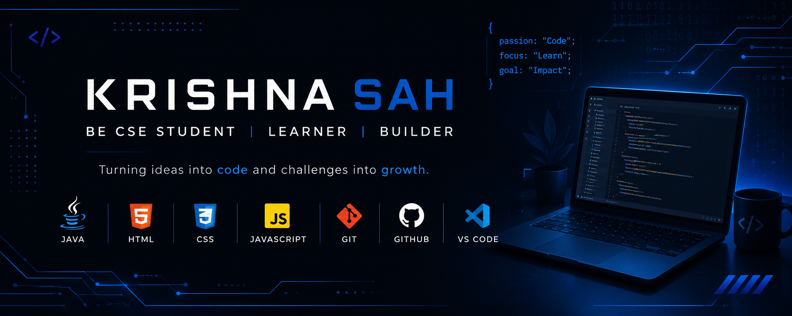

  

 
# Hi 👋 I'm Krishna

### 💻 BE CSE Student

🌱 Currently learning Java, HTML, CSS and JavaScript.

---

## 🔥 GitHub Streak

---

## 👨‍💻 About Me

- 🎓 BE in Computer Science and Engineering
- 🌱 Currently learning Java, HTML, CSS and JavaScript
- 🚀 Building projects to improve my development skills

---

## 🛠️ Languages and Tools

- Java
- HTML5
- CSS3
- JavaScript
- Git
- GitHub
- VS Code

---

## 📂 Featured Projects

- 📚 Library Management System
- ✅ To-Do App
- 🧮 Calculator
- 🔐 Login Form UI

---
